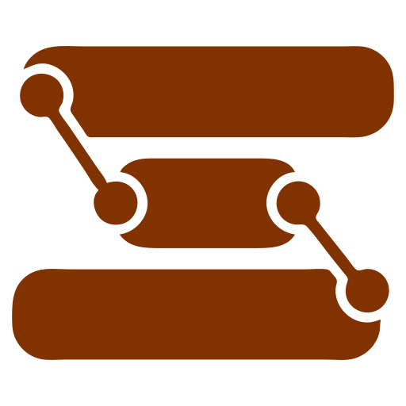

# Stratum

<p align="center">
  
</p>

[](https://github.com/short-circuit/stratum/actions/workflows/ci.yml)
[](https://github.com/short-circuit/stratum/actions/workflows/release.yml)
[](LICENSE)
[](https://short-circuit.github.io/stratum/docs/)

**Your second brain. No strings attached.**

A personal knowledge management system that **doesn't own your notes**.
Every note is a plain `.md` file on disk. No proprietary format. No cloud lock-in.
Just you, your ideas, and a tool that gets out of your way.

Think Logseq's block outliner meets Obsidian's graph view, built on a Rust engine
that stays fast even with 10,000+ notes — all running fully offline.

---

## Why Stratum?

Your notes should outlive your note-taking app. Most PKM tools either lock you into
a proprietary format, require a cloud subscription, or slow down as your knowledge
grows. Stratum was built differently from the ground up.

- **Plain Markdown files** — open any note in any text editor. If Stratum disappeared
  tomorrow, you'd lose nothing.
- **Fully offline** — every feature works without internet. AI too (bring your own
  Ollama).
- **Fast at scale** — search in under 100ms at 10k notes. The editor doesn't stutter.
  The graph doesn't lag.
- **Zero vendor lock-in** — no proprietary database, no cloud sync dependency.
  Your `.md` files are portable by design.

## At a Glance

| | |
|---|---|
| 🧱 **Block Outliner** | Every paragraph is an addressable block. Indent, outdent, drag, collapse. |
| 🔗 **Wiki-Links** | `[[Link]]` with autocomplete, backlinks panel, and unlinked mentions. |
| 🕸️ **Knowledge Graph** | Interactive force-directed graph. Find orphans, explore clusters. |
| 🔍 **Full-Text Search** | Sub-100ms search. Tag search with `#tagname`. |
| 📊 **Datalog Queries** | Query your knowledge graph like a database. |
| 📅 **Daily Journal** | Auto-created daily notes. Capture fast, process later. |
| 📋 **Templates** | Reusable templates with variable substitution. |
| 🃏 **Flashcards** | Spaced repetition from your notes. Write once, remember forever. |
| 🎨 **Whiteboards** | Excalidraw spatial canvas for visual thinking. |
| 🧮 **Math & Diagrams** | KaTeX equations and Mermaid diagrams inline. |
| 🤖 **AI Assistant** | Rewrite, summarize, interlink. Bring your own LLM. |
| 🌐 **Web Research** | Multi-depth web research via SearXNG. |
| 🔄 **Git Sync** | Auto-commit, push, pull. Version history built in. |
| ⌨️ **CLI** | Full terminal interface — init, search, export, and more. |

## Quick Start

### Nix (recommended)

```bash
nix develop ./nix
cargo build --workspace
npm install
cargo tauri dev
```

### Manual

Requires Rust 1.75+, Node.js 22+, and Tauri v2 system libraries
([install guide](https://short-circuit.github.io/stratum/docs/getting-started/installation/)).

```bash
cargo build --workspace
npm install
npm run tauri:dev
```

## Get Involved

Stratum is in active development — all core features work, and there's plenty
more to build. Check the [full documentation](https://short-circuit.github.io/stratum/docs/)
for setup guides, feature walkthroughs, and the CLI reference.

Contributions welcome. See [CONTRIBUTING](https://short-circuit.github.io/stratum/docs/contributing/)
for the development workflow and conventions.

## License

AGPL-3.0-only — see [LICENSE](LICENSE).
