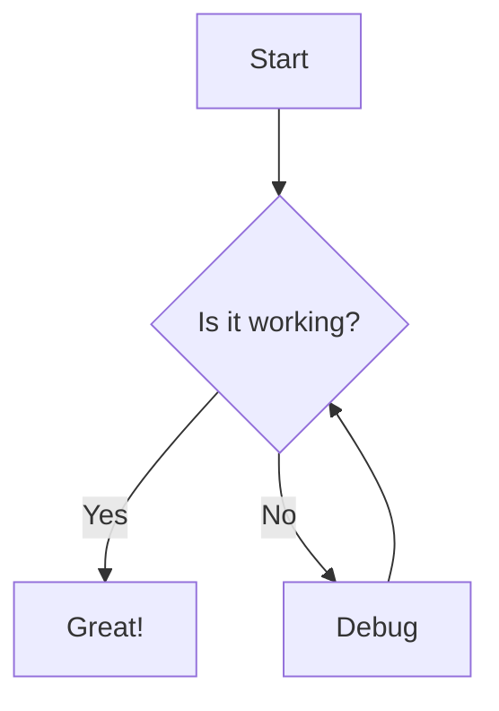
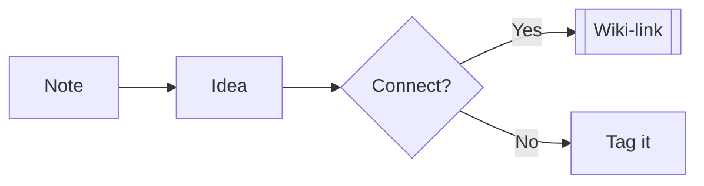
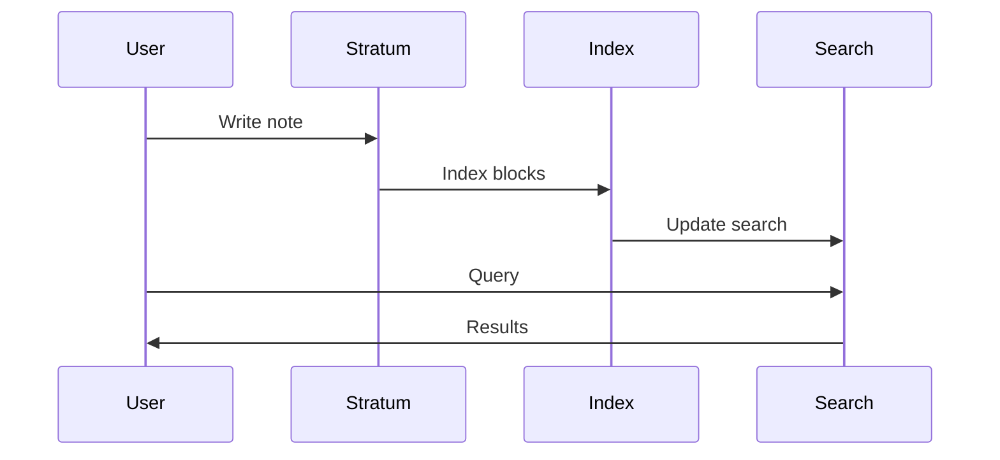
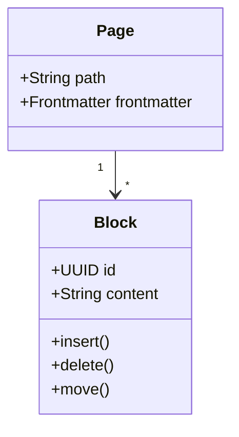
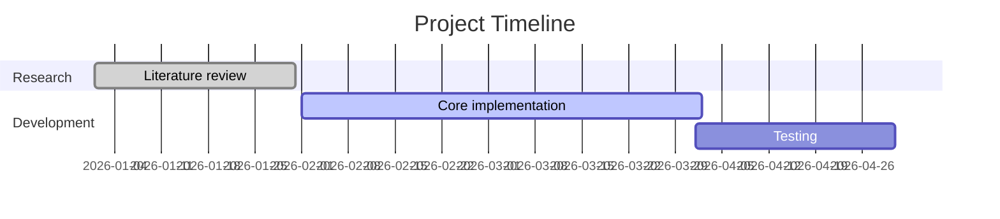
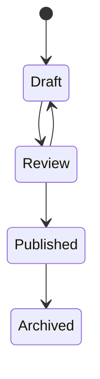
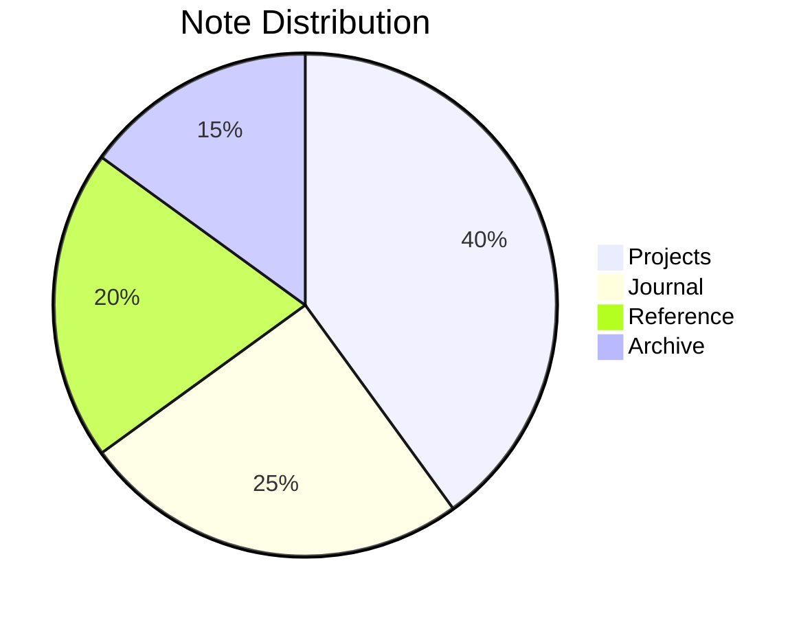

# Mermaid Diagrams

Create diagrams inline in your notes using Mermaid syntax.

<!-- SCREENSHOT: [mermaid-diagram] A flowchart rendered inline in the editor -->

## Creating a Mermaid Diagram

Write a fenced code block with the language set to `mermaid`:

````markdown

````

The diagram renders automatically below the code block.

## Supported Diagram Types

### Flowchart



### Sequence Diagram



### Class Diagram



### Gantt Chart



### State Diagram



### Pie Chart



## Editing Diagrams

- **Click the code** section to edit the Mermaid source
- **Click the diagram** to view it (toggle between code and diagram view)
- The diagram auto-renders as you type
- Use the grab cursor to pan within large diagrams

## Diagram Settings

Mermaid respects your theme setting:

- **Light mode** — default theme
- **Dark mode** — dark theme (auto-detected)

## Tips

- Use `graph TD` for top-down flowcharts, `graph LR` for left-right
- Sequence diagrams are great for documenting workflows and processes
- Gantt charts work well for project planning directly in your knowledge base
- Combine diagrams with wiki-links for deep documentation
